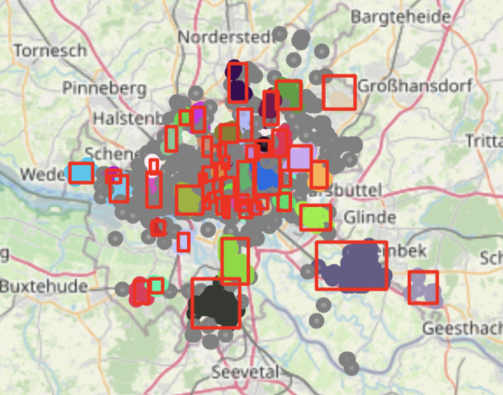

# case_study

[jump to the solution](#solution)

or have a look at how to run the project below.

## How-To Run:

### Installation

Requirements:

- Python 3.9+

**MacOS**

Setup:

1. Clone the repository
``` bash
$ git clone https://github.com/kaushikdayalan/case_study.git
```

2. Initialize the virtualEnv
``` bash
$ cd case_study
$ pip install virtualenv
$ python3 -m venv .env
```

3. Activate the environment
``` bash
$ source .env/bin/activate
```

4. Install required libraries
``` bash
$ pip install --no-cache-dir -r requirements.txt
```

**Windows**

1. Clone the repository
``` bash
$ git clone https://github.com/kaushikdayalan/case_study.git
```

2. Initialize the virtualEnv
``` bash
$ cd case_study
$ pip install virtualenv
$ python3 -m venv .env
```

3. Activate the environment
``` bash
$ .\.env\Scripts\activate
```

4. Install required libraries
``` bash
$ pip install --no-cache-dir -r requirements.txt
```

#### Running the code

I have created a detailed Jupyter notebook at `src/jupyter/eda_notebook.ipynb`, which explains each step involved in the pipeline. It includes exploratory data analysis, intermediate outputs, and reasoning behind key decisions made during development.

If you want to run the resuable pipeline script you can execute the python script `run_pipeline.py`.

To test it out with the given dataset, you can run the following command

``` bash
# with fine-tuned parameters
$ python run_pipeline.py --site_df_path "./data/raw/DE_HomeworkAssignment.csv" --eps_km 0.25 --min_sample_size 7 --min_samples 3 --output_dir "./data/staging" --enriched_dataset_save_path "./data/mart"
```

``` bash
# with default parameters
$ python run_pipeline.py --site_df_path "./data/raw/DE_HomeworkAssignment.csv" --output_dir "./data/staging" --enriched_dataset_save_path "./data/mart"
```

## Solution

### Introduction
Bofore I wanted to take over the tasks, I wanted to explore the dataset and make some visualisations. This would easily help me gather some assumptions about the dataset and come up with a plan to tackle the problem. 

Initial data driven approaches led me to the conclusions that
- All POIs belonged to Hamburg
- There were no null values in the dataset.
- GeoCoordinates is a stringified version of [longitude, latitude]

**Visual Inspection** of the data would be crucial and easy to evaluate the GeoCoordinates of the given sites. 

This helps validate two key assumptions: 
- To verify if all points lie within Hamburg as expected. 
- Check for outliers or wrong coordinates. 

**Visualisation of all sites**


<small>(visualized using folium)</small>

- The interactive map confirms that the majority of charging sites are located within Hamburg, as expected.  
- However, several outliers are visible outside the Hamburg border some even far beyond Germany.  

A simple cleanup step was applied where a bounding box approximately the size of Germany was applied to exclude the extreme outliers while preserving those that still lie within Germany. 


(The choice to preserve all sites within Germany although did not belong to Hamburg was a choice made as the data for the sites possibly come from clients or reliable APIs.)


### (TASK 1) POI Data Acquisition Approach
Taking into consideration the recommended API options, I explored them and did some research about how they would work, considering their pros and cons.

#### OpenStreetMap (OSM)

OpenStreetMap would be the open-source approach for data enrichment. All data is free to access and has a wide range of contributors.

**Pros**
1. Open source.  
2. No quota ranges to query data from the API (but rate limits and bans still apply in practice).  
3. No need to create an account or manage API keys.

**Cons**
1. Does not contain any rating or review data that could be used to analyze POIs.  
2. Data is mostly populated by the community; it purely depends on what people have tagged.  
3. The API is rate-limited in terms of how many requests can be sent from a single IP address (1 request/second).  
4. Need to learn OverpassQL syntax.  
5. Slow on very large queries from densely populated areas.  

#### Google Maps API
Google Maps API is one of the largest and most frequently updated global databases (one of the most frequently used map services in the world).

**Pros**
1. High data accuracy with rich metadata, including POI relevance, ratings, and popularity.  
2. Business owners frequently update their own business data, which means more accurate and up-to-date information.  
3. Easy to use and strong API.  
4. High reliability and performance as a managed service.

**Cons**
1. Limited free tier to access the API.  
2. Need to manage billing and API keys.  
3. Google's terms of service restrict us from caching, storing, or exporting POI data for offline, non-Google use.  
4. Costs can quickly increase for large-scale scraping or exports.

#### Conclusion
Looking at the pros and cons for each of the APIs, I strongly believe OSM would be the right way to go for analytics. Due to Google’s terms of service, storing or analyzing POI data offline may not be compliant. Therefore, we’ll only consider Google Maps for interactive, real-time lookups (if permitted). For offline analytics and enrichment, OSM is more appropriate.

### My Approach

For now, I will go the open-source route, using OSM Overpass API to procure all the data.

The key bottleneck here would be the rate limit of **1 request/second**, which needs to be addressed.

If we have to query the POIs sequentially, it would take 1400 seconds (~approx. 23–25 minutes) to extract the POIs for each site. This would be extremely inefficient just to populate raw data before enriching the dataset.

Looking through the documentation of OSM, we see that we can query points on the map using a bounding box [Overpass API documentation for bounding box queries](https://dev.overpass-api.de/overpass-doc/en/full_data/bbox.html), which gives us a good starting point to query the data. I could create a bounding box around the interesting regions and extract all POIs within that bounding box.

In case there are some points that lie far away and cannot be included in a bounding box, we can query the POIs for them on an ad-hoc basis using the `around` function [Overpass API documentation for around queries](https://dev.overpass-api.de/overpass-doc/en/full_data/polygon.html).

#### Creating the bounding box to extract POIs
A simple, single bounding box is not a feasible solution for a densely populated region like Hamburg, as this would most likely lead to request timeouts when querying the Overpass API.

Instead, we can frame this as an unsupervised clustering problem. By clustering sites that are geographically close to each other, we can create a bounding box for each cluster. This allows us to follow a localized POI extraction strategy, reducing query size and avoiding timeouts while still covering all points of interest efficiently.

#### A simple K-Distance plot
To validate if there is really a good number of closely placed sites. 

This method helps us understand how close the sites are to each other based on geographic distance. The **Haversine metric** is used to calculate distances on a sphere — appropriate for latitude/longitude data.


- The flat region in the plot indicates dense clusters of sites.
- The "elbow" appears around index ~1350, where the distance to the 5th nearest neighbor starts to increase rapidly. Which suggests there are only few sites that lie at a distance of approx 400km away from the nearest site.
- This plot also helps us choose an approximate `eps` value to fine-tune the clustering model.
- Since much of the curve lies close to zero, this suggests most sites lie within **1.5 to 3 km** of at least 4 other sites (i.e., the 5th neighbor in a dense area).


#### Clustering the sites
I chose the **HDBSCAN** model over traditional methods like **DBSCAN** or **k-Nearest Neighbors** because it provides more flexible clustering, especially for real-world spatial data.

This makes it more suitable for datasets with **variable density**, such as geographic locations where some areas (e.g., city centers) are very dense, while others (e.g., suburban or rural areas) are more sparse.

**Baseline HDBSCAN Model Results**



The base HDBSCAN model was able to identify **50 clusters**, with the largest cluster containing **75 sites**. While this indicates that some geographic patterns exist, The model also labeled **591 sites as noise. 

This number of unclustered sites is quite high and presents a practical issue: sending 591 separate POI queries to the Overpass API would be inefficient and slow, especially given the API's rate limits.

#### Fine-Tuning the HDBSCAN Model

To improve cluster coverage and reduce the number of isolated (noise) points, I experimented with several combinations of HDBSCAN’s key parameter.

Compared to the baseline model (which had 591 unclustered sites), this configuration significantly reduced the number of isolated points. This will help minimize the number of separate Overpass API queries we need to make — reducing latency, load, and overall complexity in the enrichment process.


While one cluster is quite large (723 sites), the rest are distributed reasonably, and the remaining noise points can be handled with ad-hoc POI queries using `around:` filters.

#### Querying the POI Data

The site coordinates are clustered, it’s time to query the POI data. I will implement two separate functions for this:

1. A function that queries POI data using the `bounding_box` filter, applied to clusters of sites.
2. A fallback function that uses the `around` filter for individual sites not included in any cluster, ensuring full geographic coverage.

This hybrid approach optimizes for performance and reliability:

- **Bounding box queries** minimize API calls and reduce the risk of hitting rate limits or timeouts by handling groups of nearby sites in a single request.
- **The `around` filter** provides coverage for edge cases and isolated locations that may not be captured effectively in clustering.

Both functions will include basic error handling and retry logic to account for Overpass API limitations or potential request failures.

**Benchmarking**

As discussed earlier, the goal of clustering the sites was to reduce the overhead of querying POIs for each site individually. 

I have created a quick benchmark section in the jupyter notebook `src/jupyter/eda_notebook.ipynb`.

**The results:**

**Individual Site Queries**  
   - One `around` query per site  
   - Total: 1,391 requests  
   - Time taken: **39.53 minutes**

**Clustered Bounding Box Queries**  
   - One `bbox` query per cluster (29 clusters)  
   - Fallback: `around` queries for 174 unclustered/noisy sites  
   - Total: **203 requests** (29 + 174)  
   - Time taken: **5.85 minutes**

Using clustering reduced API query time from ~39.5 minutes to ~5.8 minutes, achieving a 6.8× speedup and reducing API load by ~85.4%.

#### Saving the Raw POIs Data

Now, as we have extracted the POIs for the clusters and individual sites. Let's dump the raw data into a folder called `data/raw`. This can be assumed as an S3 bucket or any data lake services(**Bronze Layer**).

ex: 
````
data/
├── raw/
│   ├── pois_cluster/
│   │   ├── cluster_0.json
│   │   ├── cluster_1.json
│   │   └── ...
│   └── pois_individual/
│       ├── site_id_1.json
│       ├── site_id_2.json
````

Which we will later explore and transform the data in the **silver layer**. 

### (TASK 2) Data Transformations and Data Enrichment

The raw data has been dumped into the folder `data/raw/`.

To enable structured enrichment and downstream analytics, we transform the raw POI JSON data into normalized staging tables, one for each POI category 

- `fast_food`
- `fuel station`
- `supermarket`

This approach offers several key advantages:

- **Schema flexibility**: Each POI category may contain different tag keys and metadata. By splitting them into separate tables, we can handle schema evolution independently for each category.
- **Easier feature selection**: Flattening POIs by category makes it easier to identify and select relevant tags for enrichment.
- **Performance**: Category-specific transformations are simpler to parallelize or test independently.

### These are the steps I have followed in the transform layer:

1. **Load Raw POIs**: Read raw POI JSON files saved during the extraction step.
2. Clean the data

    - **Deduplicating the queried POIs:**
    
    since node IDs and way IDs can overlap numerically but refer to different geographic entities, we deduplicate nodes and ways separately to ensure accuracy. This prevents the removal of distinct POIs that happen to share the same ID value across different OSM element types.
    - **Extrating the lattitude and longitude for the OSM way element:**

    Since OSM ways represent linear or area features rather than single points, they do not have direct latitude and longitude coordinates. Instead, the Overpass API provides a center object containing the approximate centroid of the way.

    - **Validate latitutde and longitude values**:

    Since the OSM data is community contributed, I introduce a check to validate `lat` and `lon` just in case anything is not correct.

To standardize the coordinate fields across different OSM element types (nodes and ways), we extract `center.lat` and `center.lon` and assign them to the `lat` and `lon` columns, respectively.

3. **Normalize Records**: Flatten nested JSON objects, especially the `tags` field.

I will introduce a new column called category with values (`fuel`, `fast_food`, `supermarket`) which will allow us to easily categories POIs when working with the data.

4. **Export staging Tables**: Save each normalized DataFrame as a CSV, one per POI category:
   - `fast_food_pois_data.parquet`
   - `fuel_pois_data.parquet`
   - `supermarket_pois_data.parquet`

To include the site data into the silver layer I will drop unnecessary columns from the DataFrame that has site data. This will help reduce clutter and improve performance. The resulting cleaned DataFrame will be stored as an staging version for further use.

These files form the **Silver Layer** of the ETL pipeline and will be used in the next step to calculate geospatial distances and enrich the site dataset.

The transformed and processed data is then saved in the folder `data/staging`. This can act as a staging layer or if the data could be fully normalised a data warehouse(snowflake etc.).

````
data/
├── staging/
│   ├── fast_food_pois.parquet
│   ├── fuel_stations_pois.parquet
│   ├── site_data.parquet
│   ├── supermarket_pois.parquet
````

#### Finding POIs within 100m of the sites

After cleaning and normalizing the raw POI datasets for fast_food, fuel, and supermarket categories, the next step in enriching our site data. We have to establish geospatial relationships between charging sites and nearby POIs.

This involves calculating the geodesic distance between every site and every POI using the Haversine formula.

I would be following these steps to create the initial proximity dataset before adding in new features: 

1. **Extract Core Coordinates:**

    From each POI category dataset, extract just the essential columns:
    poi_id, lat, lon, and category
    These are concatenated into a single `pois_merged_df`.

2. **Cartesian Join of Sites and POIs:**

    To calculate pairwise distances, I perform a full cross join between the sites_df and pois_df using a temporary dummy key. 

3. **Compute Distances Between All Pairs**

    Using the vectorized haversine() function, I compute the distance between each site and every POI.

    The cartesian join along with a vectorized approach to calculate the distances at O(n) rather than directly calculating the distance between each site and each POI leading to O(n^2).

4. **Filter to Nearby POIs**

    From this expanded pairwise dataset, I retain only rows where the distance_m is ≤ 100 meters, forming the final proximity_df.

| site_id                                       | poi_id       | distance_m | category |
|----------------------------------------------|--------------|------------|----------|
| ReIHwjD6MLNhqFGY_tibwXKyF-g3yuKaocRq9aOE7ks   | 7623149481   | 72.798305  | fuel     |
| Khrw4EAVmEsYW363xbHVY-hYBJeqDL9jqpXbf98ygNw   | 10765936553  | 12.067036  | fuel     |
| djLmxfLNAbwwoqyegPCLkqzkVLgyLdrLfYNTrA9NyeU   | 10765936554  | 26.725120  | fuel     |
| lC_JXXvjf0G3jTECmwASMSjy3qEC5vAy8NdPyvKgFeE   | 12855774085  | 9.493484   | fuel     |
| pkoLIsK14JbAM6Od2jVF0E2txbFMgvuomlya0JGfKfc   | 816206973    | 80.712724  | fuel     |

### Data Enrichment (Golden Layer)

Before enriching the dataset, I would like to explore the tags individually.  
This exploration allows me to identify features that:

- Generalize well across all tags  
- Aggregate similar types of tags  
- Capture category-specific patterns that provide meaningful insights

#### List of Features I Would Like to Extract
These are the list of features I could come up with given the time constraint after exploring the different tags that exist for each POI category.

**General Category Features**

- Total number of POIs  
- Number of supermarkets  
- Number of fast food locations  
- Number of fuel stations  
- Category with the closest proximity to the site  

**POI related features**
- Number of POIs open 24 hours
- Any POI has a toilet
- Any POI has WiFI/Internet
- Any POI has seating
- big brand name in any of the POIs

I then create groupings and joins and transformations in the data to create the final enrichment dataset. 

The enirched site_dataset can be found in the folder `data/mart/enriched_sites.csv`.
This could also be a parquet file but I saved as a `csv` file for easy exploration and inspection.

sample enrichment dataset:

| site_id                                   | locality | postalCode | state   | operatorId | operatorName            | lon       | lat       | total_num_pois | num_fast_food | num_fuel_stations | num_supermarkets | closest_category | has_toilet | has_wifi | has_seating | open_24hr | tags.brand |
|-------------------------------------------|----------|------------|---------|------------|--------------------------|-----------|-----------|----------------|----------------|--------------------|------------------|------------------|------------|----------|-------------|-----------|-------------|
| -4ZBQG-7Q6NqIB0E-IKSTEPG9lYhs0HdwxuBQCJ5rGM | Hamburg  | 22041      | Hamburg | DEHHM      | Hamburger Energiewerke   | 10.076880 | 53.579440 | 0              | 0.0            | 0.0                | 0.0              | NaN              | NaN        | NaN      | NaN         | NaN       | NaN         |
| -7GAlj5KMjg81KmaOcdIlmUrDZLpYp_kp_pXqeePYdc | Hamburg  | 20095      | Hamburg | DEHHM      | Hamburger Energiewerke   | 9.993134  | 53.548933 | 2              | 2.0            | 0.0                | 0.0              | fast_food        | False      | False    | True        | False     | Asiahung    |
| -7GAlj5KMjg81KmaOcdIlmUrDZLpYp_kp_pXqeePYdc | Hamburg  | 20095      | Hamburg | DEHHM      | Hamburger Energiewerke   | 9.993134  | 53.548933 | 2              | 2.0            | 0.0                | 0.0              | fast_food        | False      | False    | True        | False     | None        |
| -AolBOqEu0y-HEbZ74WdzDFCQc4N6zoS9z1bDtUBSPo | Hamburg  | 22767      | Hamburg | DEHHM      | Hamburger Energiewerke   | 9.999160  | 53.549600 | 0              | 0.0            | 0.0                | 0.0              | NaN              | NaN        | NaN      | NaN         | NaN       | NaN         |


## Limitations

- **Model fine-tuning required for new data**:  
  Unsupervised clustering significantly reduces the time needed to extract POIs using the Overpass API. However, the model may need fine-tuning when new site data is introduced, as cluster boundaries can shift. While the default values perform reasonably well, they are not always optimal. This approach is still faster than sequential queries on large datasets.  
  *(A possible enhancement is to automatically detect noise and apply adaptive fine-tuning techniques to improve clustering.)*

- **Missing type checks**:  
  Due to time constraints, type validation is currently missing. This is critical for ensuring data integrity and should be addressed in future versions.

- **No verification of OSM data accuracy**:  
  There is no mechanism to confirm whether the OSM data is accurate or if all relevant POIs have been successfully extracted for each site.

- **Static data ingestion categories**:  
  The data ingestion layer is currently limited to three predefined categories. A more dynamic system could allow flexible input and new Overpass query types.

- **Separate ETL processing per category**:  
  The current ETL pipeline processes each category's dataframe independently. This could be improved by implementing a unified, dynamic ETL approach—especially if the transformation logic is similar across datasets.

- **Strict radius results in missing POIs**:  
  Out of 1,391 sites, 871 have no POIs found within a 100-meter radius due to strict proximity rules. An improvement would be to increase the search radius dynamically when no POIs are found.
